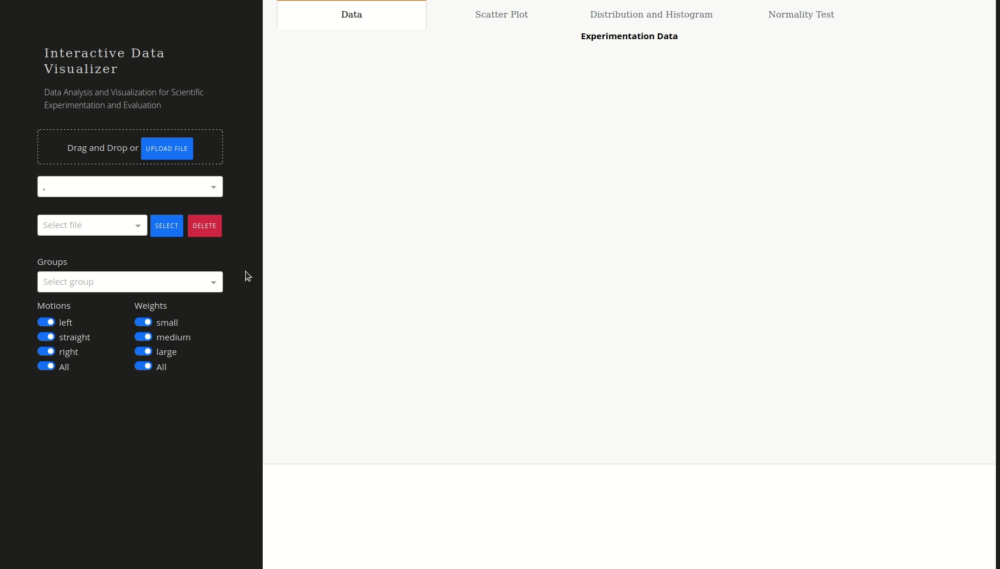

# Interactive Data Visualizer for Scientific Experimentation and Evaluation

This package contains a web-based visualization tool for visualizing scientific 
experimation data. It is built on top of [Dash](https://dash.plotly.com/) and [Flask](https://flask.palletsprojects.com). Dash uses Plotly to provide an interactive 
visualization of the data.

The tool expects a csv file containing the following attributes:
* `x` : the position in x axis
* `y` : the position in y axis
* `theta` : the orientation of the robot
* `group` : group id
* `motion` : left (l), straight (s), and right (r) representing the motions for lego robot experiments and representing the place location for the KUKA youBot arm experiments
* `weight` (optional) : small (s), medium (m), large (l) representing the size of the objects to be placed

The visualization includes:
* Tabular data
* Scatter plots
* Histogram and probability distribution
* Normality test using Lilliefors, Shapiro-Wilk, and chi square
* Quantile quantile (QQ) plots



## Installation and Usage
* Local install
  ```
  pip install -r requirements.txt
  ```
  
  Run with gunicorn
  ```
  gunicorn --config gunicorn_config.py index:server
  ```

* Using docker
  ```
  docker build -t digiklausur/idv:latest .
  ```
  Run the visualization tool
  ```
  docker run -d -p 8085:8085 digiklausur/idv:latest
  ```

## Deployment on Kubernetes

## Usage with Jupyter